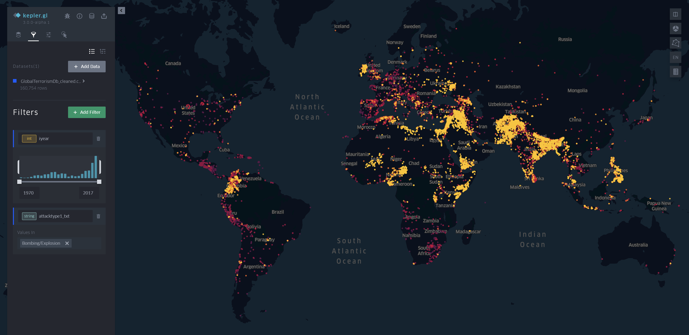
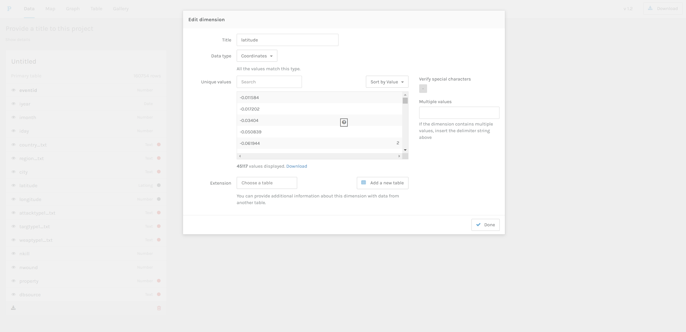
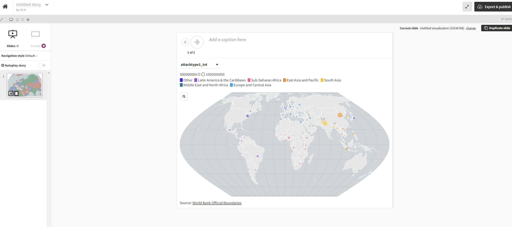

I uploaded the terrorism csv dataset from GTD.  

I could easily upload the dataset into the tool. Fortunately, it was able to handle the large data. I was able to easily visualize the data, and the point mapping was automatic, so I did not have to put a lot of effort into it. I was trying other visualizations on the tool, but nothing else was as effective as this one. I added the filters of year and attack type, so I began seeing only data about explosions. The map is interactive, and shows me the event_id, the year, day and month as well as the country. The mapping is done based on the latitude and longitudnal data. I could easily create and visualize differences in the filtered dataset. The export creates a html file, so it can be embedded in a website.

With Palladio, for some reason the co-ordinates were not coming up. I took a couple of days to try to figure out what was wrong. Apparently, Palladio was not able to recognize '-' co-ordinates, since it was treating them as a number, and it did not have enough computational power to change the co-ordinates in the webapp. Despite me verifying the same, it couldn't take in that data. I was wondering why keppler was able to do it, and Palladio not, since Palladio seemed to have done so well in the previous network analysis assignment. 
I even thought I could outsmart the issue by adding the city as the location of the attack, but even that did not work out.

This tooks very long to figure out. I couldn't get the dataset to load at first, then couldn't preview the visualization and after that, I was not able to find the region layer to see the world map. Further, all points were aggregated together, instead of having single points, which beat the purpose of the visualization. Filtering is something I could not figure out on the interface, since even if I selected a particular coulmn to visualize, the preview never changed. Export was pretty simple, but needed a premium version to download the html. This tool is probably not optimal for my dataset.

I tried StoryMap.JS as well, but I couldn't figure out how to get the dataset to upload onto the tool. I looked for tutorials online and on the website, but I couldn't get it done.

 
By 
Sanchita Kamath 
Doctoral Student - Information Sciences