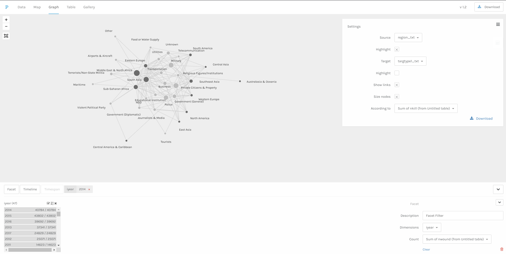
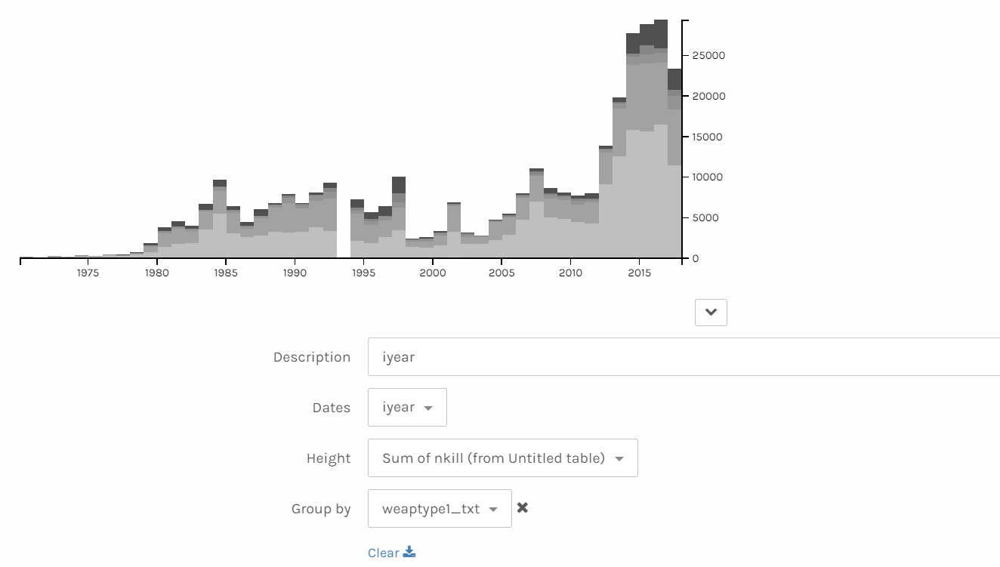

I decided to experiment with the data that I am planning to import for my DH workshop (the abstract data wasn't giving me desired visualization) 
The objective of the assignment was to upload data and calculate network metrics.
 
I tried aploading my material (a csv file) directly into the Gephi-Lite, which apparently wasn't possible. So, I surfed the web for alternatives, which gave me a Table2net resource to create a .gexf file. I thought the issue was solved, but because my file was too large, the browser stopped responding. A question I would like to raise here is that: "Is it necessary for larger datasets to be run on local computation sources with higher budgets (meaning lite versions are computationally challenged?) or is cloud computing possible?" (and I wasn't able to find it?)  

Upon the befalling of this predicament, my strategy should have been to download Gephi, but I decided to move to Palladio, to answer the question I posed before. Surprisingly, Palladio worked really well.   

NETWORK GRAPH GENERATED ON PALLADIO 
 

For the network metrics, I set the size of the node based on the number of people who lost their lives in that particular region in a particular year. I could not visualize bipartite relationships, which I could atleast create through Table2net, but couldn't visualize.
  
Further, I created the following visualization through Palladio as well, which helped me group temporal data by number of people who lost their lives to a particular weapon. 

  

After this I tried to export the visualization, which happened, but the graph was no longer interactive for me.  
 
Further, I tried the Network Navigator for the same data, but the page showed me the same message as the Gephi Lite, which re-afffirmed my earlier question, and I wonder if there are other tools like Palladio that can handle mass data.

Error Message from Gephi Lite and the Network Navigator:

 
By 
Sanchita Kamath 
Doctoral Student - Information Sciences

 
By 
Sanchita Kamath 
Doctoral Student - Information Sciences